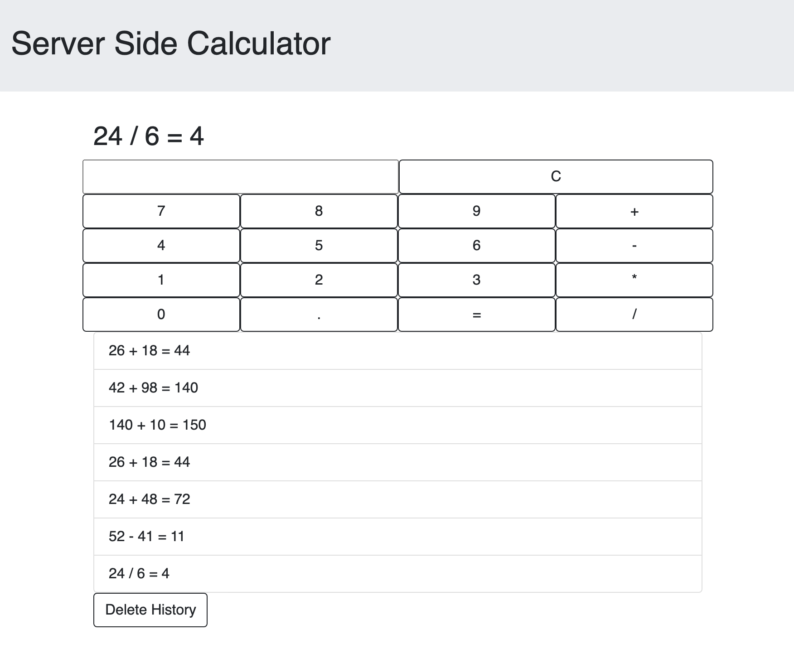

# Server Side Calculator - STRETCH MODE

## Description

Server Side Calculator is a single page app that functions as a basic calculator. It takes in two values and an opperator, and the "=" button sends the equation to the server to be evaluated. Upon evaluation, the server then stores the history of equations evaluated, which it in turn sends back to the client to be rendered to the DOM as an unordered list. The "C" button will empty the input fields.

## Screen Shot

## Built With

HTML 5, CSS 3, Bootstrap 5, Javascript, jQuery 3.5, Node.js 15.4, Express 4.17

## Acknowledgement
Thanks to [Prime Digital Academy](https://www.primeacademy.io) who equipped and helped me to make this application a reality.

## Support
If you have suggestions or issues, please email me at dunnmj42@gmail.com
